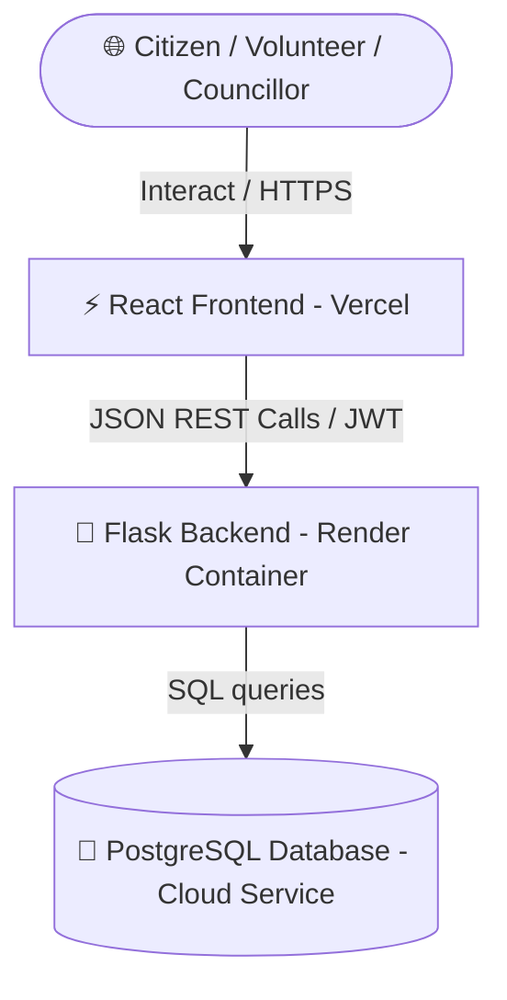

# 🏛️ Unified Civic Intelligence Ecosystem — Production Blueprint
This document serves as the complete, single-file master blueprint of the entire production-ready **Unified Civic Intelligence (UCI)** platform. It details the modular architecture, database structures, headless API interfaces, container startup sequences, and Vercel-Render hosting configurations.

---

## 🌐 1. Architecture Topology



* **Frontend Hosting (Vercel)**: Serves the responsive React single-page application (SPA), running in Vite with auto-routing.
* **Backend Hosting (Render)**: Runs the Flask WSGI application using a high-performance multithreaded Gunicorn worker pool within Docker.
* **Database (PostgreSQL)**: Serves as the high-availability relational storage for auditing, transparency ledgers, profiles, and public reports.

---

## 🐘 2. Database Models & Schema Design
All tables are automatically constructed on the PostgreSQL database on container boot. Below is the active schema design:

### 👤 Identity & Role Management
* **`users` Table**:
  * `id` (Integer, Primary Key)
  * `email` (String, Unique, Indexed)
  * `password_hash` (String, Encrypted)
  * `full_name` (String)
  * `role` (Enum: `admin`, `citizen`, `volunteer`, `councillor`)
  * `ward_id` (Integer, Foreign Key to Wards)
  * `created_at` (Timestamp)

### 🗺️ Hyperlocal Wards & Governance
* **`ward` Table**:
  * `id` (Integer, Primary Key)
  * `code` (String, Unique) — *e.g., `W-101`*
  * `name_en` (String)
  * `name_ta` (String)
  * `district` (String)
  * `complaint_score` (Integer)
  * `development_score` (Integer)
  * `cleanliness_score` (Integer)
  * `happiness_index` (Float)

* **`office_contact` Table**:
  * `id` (Integer, Primary Key)
  * `ward_id` (Integer, Foreign Key to Wards)
  * `office_phone` (String)
  * `emergency_phone` (String)
  * `office_hours_en` (String)
  * `office_hours_ta` (String)

* **`public_project` Table**:
  * `id` (Integer, Primary Key)
  * `ward_id` (Integer, Foreign Key to Wards)
  * `title` (String)
  * `description` (Text)
  * `purpose` (Text)
  * `completion_percent` (Integer)
  * `status` (Enum: `active`, `completed`, `delayed`)

* **`government_fund` Table**:
  * `id` (Integer, Primary Key)
  * `project_id` (Integer, Foreign Key to Public Projects)
  * `sanctioned_amount` (Numeric)
  * `spent_amount` (Numeric)
  * `contractor_name` (String)
  * `contractor_contact` (String)

### 🚨 Complaints, Triage & Land Protection
* **`complaint` Table**:
  * `id` (Integer, Primary Key)
  * `user_id` (Integer, Foreign Key to Users, Nullable for Anonymous)
  * `ward_id` (Integer, Foreign Key to Wards)
  * `title` (String)
  * `body` (Text)
  * `category` (String)
  * `status` (Enum: `submitted`, `assigned`, `resolved`)
  * `sentiment_score` (Float) — *Generated automatically by local NLP triage*
  * `ai_category` (String) — *Auto-classified category (e.g., infrastructure)*

* **`land_report` Table**:
  * `id` (Integer, Primary Key)
  * `user_id` (Integer, Foreign Key to Users)
  * `survey_number` (String)
  * `title` (String)
  * `description` (Text)
  * `created_at` (Timestamp)

### 🤝 TVK Singapadai Volunteer Cadre
* **`volunteer_profile` Table**:
  * `id` (Integer, Primary Key)
  * `user_id` (Integer, Foreign Key to Users, Unique)
  * `district` (String)
  * `ward_code` (String)
  * `booth` (String)
  * `skills` (Text)
  * `availability` (String)
  * `points` (Integer) — *Used for leaderboards and gamification badges*

* **`membership_card` Table**:
  * `id` (Integer, Primary Key)
  * `volunteer_id` (Integer, Foreign Key to Volunteer Profiles)
  * `card_number` (String, Unique) — *e.g., `TVK-000001`*
  * `qr_payload` (String)

* **`gamification_badge` Table**:
  * `id` (Integer, Primary Key)
  * `volunteer_id` (Integer, Foreign Key to Volunteer Profiles)
  * `label_en` (String)
  * `label_ta` (String)
  * `issued_at` (Timestamp)

### 🎗️ Welfare, Donation Campaigns & Ledger
* **`campaign` Table**:
  * `id` (Integer, Primary Key)
  * `name` (String)
  * `description` (Text)
  * `goal_amount` (Numeric)
  * `raised_amount` (Numeric)
  * `distributed_amount` (Numeric)
  * `beneficiary_count` (Integer)
  * `is_active` (Boolean)

* **`donation` Table**:
  * `id` (Integer, Primary Key)
  * `donor_id` (Integer, Foreign Key to Users)
  * `campaign_id` (Integer, Foreign Key to Campaigns)
  * `amount` (Numeric)
  * `is_anonymous` (Boolean)
  * `ledger_ref` (String)

* **`trust_ledger_entry` Table**:
  * `id` (Integer, Primary Key)
  * `entry_type` (String) — *e.g., `donation`, `volunteer_service`*
  * `reference` (String)
  * `amount` (Numeric, Nullable)
  * `metadata_json` (Text)

---

## ⚡ 3. Pure Headless REST API Specification
The backend functions entirely as a secure JSON API service. All routes return structured JSON objects and arrays:

### 🔑 Authentication APIs (`/auth`)
* `POST /auth/api/register`: Registers a new platform user.
* `POST /auth/api/login`: Validates password and issues a secure JWT access token.

### 🏛️ Governance APIs (`/governance`)
* `GET /governance/wards`: Retrieves all hyperlocal ward details, statistics, and live health indices.
* `GET /governance/wards/<id>`: Returns deep analytical logs, smart alerts, and recent citizen complaints for a specific ward.
* `GET /governance/funds`: Details the transparency sheets of smart roads, drain networks, and infrastructure projects.
* `POST /governance/complaints`: Allows citizens to report issues with automatic AI classification and sentiment analysis.
* `POST /governance/land/new`: Submits survey verification requests for land/patta protection.

### 🤝 TVK Singapadai Cadre APIs (`/tvk`)
* `GET /tvk/news`: Lists recent district-level community and organizing bulletins.
* `GET /tvk/events`: Schedules volunteer rallies, medical camps, and welfare programs.
* `GET /tvk/tasks`: Outputs the local task management list.
* `GET /tvk/gamification`: Outputs volunteer leaderboards ranked by point scores.
* `POST /tvk/volunteer/register`: Submits local cadre booth details and auto-issues a digital membership QR card.

### 🎗️ Welfare & Charity APIs (`/charity`)
* `GET /charity/transparency`: Returns active public campaign data and distribution histories.
* `GET /charity/sponsors`: Lists major institutional welfare contributors.
* `GET /charity/ledger`: Displays the immutable, public trust ledger.
* `POST /charity/welfare`: Captures aid requests (medical/educational) and provides instant AI eligibility triage hints.
* `POST /charity/activities`: Logs active volunteer service hours, rewarding gamification points on the ledger.

---

## 📦 4. Automated Startup Sequence (Render Container)
To guarantee the database is fully functional without manual commands, the backend runs inside a custom Docker container with an automated **self-healing boot sequence**:

### 🛠️ Production Dockerfile
```dockerfile
FROM python:3.12-slim-bookworm
WORKDIR /app
RUN apt-get update && apt-get install -y --no-install-recommends gcc libpq-dev \
    && rm -rf /var/lib/apt/lists/*
COPY requirements.txt .
RUN pip install --no-cache-dir -r requirements.txt
COPY . .
ENV FLASK_CONFIG=production
ENV PYTHONUNBUFFERED=1
EXPOSE 5000
CMD ["sh", "-c", "flask --app run init-db && flask --app run seed-demo && gunicorn --workers 1 --threads 4 --worker-class gthread -b 0.0.0.0:${PORT:-5000} --timeout 120 run:app"]
```

### ⚙️ What happens on Boot:
1. `flask --app run init-db`: Automatically compiles and writes all SQL tables, relations, and indices to your cloud PostgreSQL database.
2. `flask --app run seed-demo`: Safely and idempotently inserts initial ward profiles, office contacts, projects, funds, and active roles.
3. `gunicorn`: Spins up a high-performance multithreaded server to answer API calls.

---

## 🚀 5. Host Setup (Vercel Frontend)
When deploying your React JS frontend in the Vercel cloud dashboard, utilize these production configurations:

* **Repository Directory Root**: `/frontend` (Since the React code is inside the subfolder).
* **Framework Preset**: `Vite` (Detected automatically).
* **Build Command**: `npm run build` or `vite build`.
* **Output Directory**: `dist`.
* **Production Environment Variable**:
  * **Key**: `VITE_API_URL`
  * **Value**: `https://civic-backend-pzzb.onrender.com`

---

## 🔑 6. Testing & Live Access Accounts
Use these pre-seeded logins on your deployed Vercel site to explore different portals:

| Role Interface | Seeded Login Email | Password |
| :--- | :--- | :--- |
| **👑 Admin Dashboard** | `admin@civic.local` | `Admin#12345` |
| **👤 Citizen Portal** | `citizen@civic.local` | `Citizen#123` |
| **🤝 Volunteer Space** | `volunteer@civic.local` | `Volunteer#123` |
| **🏛️ Councillor Hub** | `councillor@civic.local` | `Councillor#123` |
